    

    <b>Automatic Architecture Diagrams from Code</b> 
    <a href="https://github.com/swark-io/swark">GitHub</a> • <a href="https://swark.io">Website</a> • <a href="mailto:contact@swark.io">Contact Us</a>

## Usage Instructions

1. **Render the Diagram**: Use the links below to open it in Mermaid Live Editor, or install the [Mermaid Support](https://marketplace.visualstudio.com/items?itemName=bierner.markdown-mermaid) extension.
2. **Recommended Model**: If available for you, use `claude-3.5-sonnet` [language model](vscode://settings/swark.languageModel). It can process more files and generates better diagrams.
3. **Iterate for Best Results**: Language models are non-deterministic. Generate the diagram multiple times and choose the best result.

## Generated Content
**Model**: GPT-4o - [Change Model](vscode://settings/swark.languageModel)  
**Mermaid Live Editor**: [View](https://mermaid.live/view#pako:eNp9lU1P4zAQhv-KlTNdyEcL9LBS0yRoUYFCuuLg7mGaTFsviR3ZDqJC_Pd1SGltFpHbM2PPxztj5dUrRIne2FvyjYRmSxbJkhPzqXbVGzIpuEZe9ubum_h0gS96oMUgbxCL7R_LF9CFGCSCzJjStj2kjwh6i5JMmsZ2RHQupF6LignbPKRXUKNtGdFJq51c5zR9aZArJAsJxRNK23lBEyax0ORxC1rZnks6BYmmkqmoG1COzz-jMdNIYvGyN7-3_kmTuMtmSxL7NGcbfjoTG8ZJvlMaaytsHNA7WZqMN8BhgzVyW5s4pAu2XncX25UqJGs0E9w-ENFJWRt_Amq7EiBL2zmkt0KzNSugu-Ym_6r4BDSsQOExxNSnN4JvRBJbcacBvdnl97NvIv3WrGKaoTreSnx6_2CELZFcIUcJWthTSQI6T7KvXSHNCymq6gGfEaoff9U3ma_hGbpFqvZdWxWkZhS6LY3Eh06tLGlA8y00SCYSgUyhKtrqUyFpSOeS1Uhu23qFUpGM8dLZrTSid2V5mj5jNzJ70OmQxsCfGN98WvN0RGdsJUHuLMdXnd0a6Uzv_69Y5nfbLlGpozTv9sC8rFUuzHF7qbKQXj8uSPdkjBR7mWx_RKeVaEvGu5p-mSdu8ltnrNomPhkMfpoC9hi4GLoYuTh0ceTiuYsXLl666J8duLdkfWGx72LgYuhi5OLwI1jcG6b7YHHgYuhi5OLwgL0h3Qfbl5IGLoYuRi4OXRwd0Kk8c9vM3Daz6Di9XrYkdDRPAkfzxJTunXg1yhpYaf4Hr0vPbE6NS29Mll6Ja2grvfTezKG2KUFjwsBsTO2NtWzxxINWi3zHiw-Wot1svfEaKoVv_wA6G8Ko) | [Edit](https://mermaid.live/edit#pako:eNp9lU1P4zAQhv-KlTNdyEcL9LBS0yRoUYFCuuLg7mGaTFsviR3ZDqJC_Pd1SGltFpHbM2PPxztj5dUrRIne2FvyjYRmSxbJkhPzqXbVGzIpuEZe9ubum_h0gS96oMUgbxCL7R_LF9CFGCSCzJjStj2kjwh6i5JMmsZ2RHQupF6LignbPKRXUKNtGdFJq51c5zR9aZArJAsJxRNK23lBEyax0ORxC1rZnks6BYmmkqmoG1COzz-jMdNIYvGyN7-3_kmTuMtmSxL7NGcbfjoTG8ZJvlMaaytsHNA7WZqMN8BhgzVyW5s4pAu2XncX25UqJGs0E9w-ENFJWRt_Amq7EiBL2zmkt0KzNSugu-Ym_6r4BDSsQOExxNSnN4JvRBJbcacBvdnl97NvIv3WrGKaoTreSnx6_2CELZFcIUcJWthTSQI6T7KvXSHNCymq6gGfEaoff9U3ma_hGbpFqvZdWxWkZhS6LY3Eh06tLGlA8y00SCYSgUyhKtrqUyFpSOeS1Uhu23qFUpGM8dLZrTSid2V5mj5jNzJ70OmQxsCfGN98WvN0RGdsJUHuLMdXnd0a6Uzv_69Y5nfbLlGpozTv9sC8rFUuzHF7qbKQXj8uSPdkjBR7mWx_RKeVaEvGu5p-mSdu8ltnrNomPhkMfpoC9hi4GLoYuTh0ceTiuYsXLl666J8duLdkfWGx72LgYuhi5OLwI1jcG6b7YHHgYuhi5OLwgL0h3Qfbl5IGLoYuRi4OXRwd0Kk8c9vM3Daz6Di9XrYkdDRPAkfzxJTunXg1yhpYaf4Hr0vPbE6NS29Mll6Ja2grvfTezKG2KUFjwsBsTO2NtWzxxINWi3zHiw-Wot1svfEaKoVv_wA6G8Ko)

```mermaid
graph TD
    subgraph Frontend
        A1[Text-to-Speech]
        A2[To-Do List]
        A3[Weather App]
        A4[Portfolio]
        A5[Game]
        A6[Auth]
        A7[Expense Tracker]
        A8[Direct Whats]
        A9[Career Compass]
        A10[Bite Box]
    end

    subgraph Backend
        B1[Sign/Login System]
        B2[Order Management]
        B3[Tiffin Subscription]
        B4[Admin Dashboard]
        B5[Notification System]
    end

    subgraph Database
        C1[MongoDB]
        C2[MySQL]
    end

    subgraph Utilities
        D1[QR Code Generator]
        D2[PDF Generator]
        D3[ScrollReveal.js]
    end

    subgraph Java Applications
        E1[Student Database]
        E2[Shape Area Calculator]
        E3[Prime Numbers Finder]
        E4[Odd/Even Sum]
        E5[Banking App]
        E6[Library App]
    end

    subgraph Node.js Backend
        F1[Express.js]
        F2[WebSocket]
        F3[JWT Authentication]
        F4[Cloudinary Integration]
    end

    A1 --> F1
    A2 --> F1
    A3 --> F1
    A4 --> F1
    A5 --> F1
    A6 --> F1
    A7 --> F1
    A8 --> F1
    A9 --> F1
    A10 --> F1

    F1 --> B1
    F1 --> B2
    F1 --> B3
    F1 --> B4
    F1 --> B5

    B1 --> C1
    B2 --> C1
    B3 --> C1
    B4 --> C1
    B5 --> C1

    E1 --> C2
    E2 --> C2
    E3 --> C2
    E4 --> C2
    E5 --> C2
    E6 --> C2

    F1 --> F2
    F1 --> F3
    F1 --> F4

    A10 --> D3
    A7 --> D2
    A8 --> D1
```

