    

    <b>Automatic Architecture Diagrams from Code</b> 
    <a href="https://github.com/swark-io/swark">GitHub</a> • <a href="https://swark.io">Website</a> • <a href="mailto:contact@swark.io">Contact Us</a>

## Usage Instructions

1. **Render the Diagram**: Use the links below to open it in Mermaid Live Editor, or install the [Mermaid Support](https://marketplace.visualstudio.com/items?itemName=bierner.markdown-mermaid) extension.
2. **Recommended Model**: If available for you, use `claude-3.5-sonnet` [language model](vscode://settings/swark.languageModel). It can process more files and generates better diagrams.
3. **Iterate for Best Results**: Language models are non-deterministic. Generate the diagram multiple times and choose the best result.

## Generated Content
**Model**: GPT-4o - [Change Model](vscode://settings/swark.languageModel)  
**Mermaid Live Editor**: [View](https://mermaid.live/view#pako:eNqNVs1u2zAMfhVD5_YFchiwNRiwQ7dibU_zDoolJ0JtKbAlDEXRd58lWbZEUUJ8iUl-pPnzkcgH6RTj5EBaeZ7o9dK8HFvZLM9sTl7xWxnNZ6-0z4voeyG99k9LvBhQ5C8EPnJpINjqMI9fE-PTBnZSEfZkToPoANgrMZ-fSotedFQLteceKzGn70qxDWwFFMQ5O9HubQeuCgx85D01g7YNAAWsFt-bch3flHoT8ry5rTIG_Wr0ZcNZAQWxUUgwUqdryoONfGA6iWstN4sDXiVYygqPLXLDmRPOeYcS5Zw1mgpwS6ZScg_ozcIlayVYo8dlzYZsjbadKGxOujP5FgTmF7kOWJ7R-4fmYyC3fcfYmqQTOlJKK-HFnv6qSKCvsyvA_iAztP26rbOCsYH_oxMHISznt0laIf36dVCU2e-7lzhM7WsPSvbivId5GJRhQtLpfQm1CwGHhIq3rbm__7IqYuPOxAjgWi3BnXR2TwGJ3kYIyA-hQyQkkenxc4BAFtToW4ia9pas5uRcwuwK99HBMjZ6l-QERe0KjJPpLfT5zuGD2f3LJoIjNoJloNvyqeGx2LebQW3FEUJrNAVoKhVQ6xhM2O1zZK9wGNzwUu4AgbUlO-w1IlU8sNh1A5hCqQa09GrP8W5nfSZ3ZOTTSAVb_tt9tERf-LgctkPTEuZLbMnnAjJXRjU_Crpct5Ec9GT4HaFGq-d32QV5UuZ8IYeeDjP__A_ci1Xy) | [Edit](https://mermaid.live/edit#pako:eNqNVs1u2zAMfhVD5_YFchiwNRiwQ7dibU_zDoolJ0JtKbAlDEXRd58lWbZEUUJ8iUl-pPnzkcgH6RTj5EBaeZ7o9dK8HFvZLM9sTl7xWxnNZ6-0z4voeyG99k9LvBhQ5C8EPnJpINjqMI9fE-PTBnZSEfZkToPoANgrMZ-fSotedFQLteceKzGn70qxDWwFFMQ5O9HubQeuCgx85D01g7YNAAWsFt-bch3flHoT8ry5rTIG_Wr0ZcNZAQWxUUgwUqdryoONfGA6iWstN4sDXiVYygqPLXLDmRPOeYcS5Zw1mgpwS6ZScg_ozcIlayVYo8dlzYZsjbadKGxOujP5FgTmF7kOWJ7R-4fmYyC3fcfYmqQTOlJKK-HFnv6qSKCvsyvA_iAztP26rbOCsYH_oxMHISznt0laIf36dVCU2e-7lzhM7WsPSvbivId5GJRhQtLpfQm1CwGHhIq3rbm__7IqYuPOxAjgWi3BnXR2TwGJ3kYIyA-hQyQkkenxc4BAFtToW4ia9pas5uRcwuwK99HBMjZ6l-QERe0KjJPpLfT5zuGD2f3LJoIjNoJloNvyqeGx2LebQW3FEUJrNAVoKhVQ6xhM2O1zZK9wGNzwUu4AgbUlO-w1IlU8sNh1A5hCqQa09GrP8W5nfSZ3ZOTTSAVb_tt9tERf-LgctkPTEuZLbMnnAjJXRjU_Crpct5Ec9GT4HaFGq-d32QV5UuZ8IYeeDjP__A_ci1Xy)

```mermaid
graph TD
    subgraph Routes
        TiffinRoutes["Tiffin Routes"]
        TiffinMenuRoutes["Tiffin Menu Routes"]
        OrderRoutes["Order Routes"]
        OrderPublicRoutes["Order Public Routes"]
        NotificationRoutes["Notification Routes"]
        FoodRoutes["Food Routes"]
        FeedbackRoutes["Feedback Routes"]
        DefaultMenuPublicRoutes["Default Menu Public Routes"]
        BookingRoutes["Booking Routes"]
        AuthRoutes["Auth Routes"]
        AdminTiffinRoutes["Admin Tiffin Routes"]
        AdminTiffinBookingRoutes["Admin Tiffin Booking Routes"]
        AdminRoutes["Admin Routes"]
        AdminOrderRoutes["Admin Order Routes"]
        AdminMenuRoutes["Admin Menu Routes"]
        AdminDefaultMenuRoutes["Admin Default Menu Routes"]
        Admin["Admin"]
    end

    subgraph Models
        Tiffin["Tiffin"]
        TiffinMenu["Tiffin Menu"]
        Order["Order"]
        Notification["Notification"]
        FoodItem["Food Item"]
        DefaultTiffinMenu["Default Tiffin Menu"]
        TiffinBooking["Tiffin Booking"]
        User["User"]
        AdminModel["Admin"]
    end

    subgraph Middleware
        AdminAuth["Admin Auth"]
        Upload["Upload Middleware"]
    end

    subgraph Config
        Cloudinary["Cloudinary Config"]
    end

    TiffinRoutes --> Tiffin
    TiffinMenuRoutes --> TiffinMenu
    OrderRoutes --> Order
    OrderPublicRoutes --> Order
    NotificationRoutes --> Notification
    FoodRoutes --> FoodItem
    FoodRoutes --> Upload
    FoodRoutes --> Cloudinary
    FeedbackRoutes --> Order
    DefaultMenuPublicRoutes --> DefaultTiffinMenu
    BookingRoutes --> TiffinBooking
    AuthRoutes --> User
    AdminTiffinRoutes --> Tiffin
    AdminTiffinRoutes --> AdminAuth
    AdminTiffinBookingRoutes --> TiffinBooking
    AdminTiffinBookingRoutes --> AdminAuth
    AdminRoutes --> AdminAuth
    AdminRoutes --> User
    AdminRoutes --> FoodItem
    AdminRoutes --> Order
    AdminRoutes --> TiffinBooking
    AdminRoutes --> Tiffin
    AdminRoutes --> AdminModel
    AdminOrderRoutes --> Order
    AdminMenuRoutes --> FoodItem
    AdminMenuRoutes --> AdminAuth
    AdminDefaultMenuRoutes --> DefaultTiffinMenu
    AdminDefaultMenuRoutes --> AdminAuth
    Admin --> AdminAuth
    Admin --> User
    Admin --> FoodItem
    Admin --> Order
    Admin --> TiffinBooking
    Admin --> Tiffin
    Admin --> AdminModel
```

